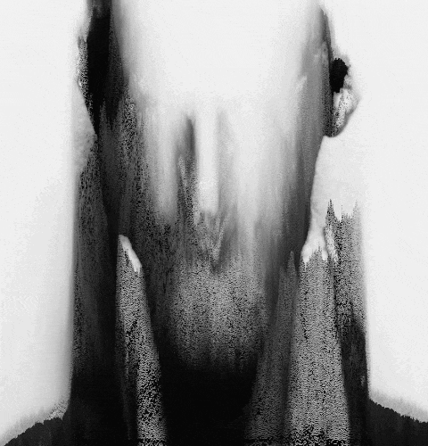

I'm an artist based in Birmingham, UK. I work mostly with cameras and images but I'm not really a photographer. Or maybe I am. What is photography anyway?

[I archive my work on Github](https://github.com/peteash10/Artworks) where you can find documentation and, where relevant, source materials and code. 

## BOM Fellowship

Most of my work is anchored by my [fellowship](http://www.bom.org.uk/bom-fellows/) at [Birmingham Open Media](http://www.bom.org.uk/) where I have been based since it opened in November 2014. 

This work is currently being [developed on Github](https://github.com/peteash10/2017-body-of-work) and will start taking shape through 2017. 

During 2016 my fellowship work was mostly a sabatical based around [Speculative Cameras](https://github.com/peteash10/Artworks/blob/master/Speculative%20Cameras/ReadMe.md), rethinking the camera as an artistic tool. I introduced it at a [Fellows talk](https://vimeo.com/159868781) in March. 

<iframe src="https://player.vimeo.com/video/159868781?byline=0&amp;portrait=0" width="640" height="240" frameborder="0" webkitallowfullscreen="" mozallowfullscreen="" allowfullscreen=""></iframe>

## Commissioned Works

[20/20 Visions](http://kwmc.org.uk/projects/2020visions/) - essay comissioned by Knowle West Media Centra for their 20th anniversary (forthcoming).

[The Droids](https://github.com/peteash10/Artworks/tree/master/The%20Droids) - part of [Fermynwood's Open Online Six: Too Long For iTunes](http://www.fermynwoods.co.uk/current-programme/open-online-six/)

[Instabeck](https://github.com/peteash10/Artworks/tree/master/Instabeck) - part of [The JHB Archive](http://www.jogane.co.uk/projects/286/lost-sculpture-the-jhb-archive/) curated by Jo Gane

[Ikon Traces Walking Tour](https://github.com/peteash10/Artworks/blob/master/Ikon%20Traces/ReadMe.md) - commission from the [Ikon gallery](https://ikon-gallery.org) and the [Still Walking](http://www.stillwalking.org/) festival to devise and run a photography walk visiting the sites of their previous venues over their 50 year history, many of which had been demolished.

## Major Uncommissioned Works

I like to be always making new work. These are a small number of pieces that I'm pleased with or which resonated with others.

[Sitting In Stagram](https://github.com/peteash10/Artworks/blob/master/Sitting%20In%20Stagram/ReadMe.md) (2015)  
An Instagram-specific piece re-appropriating Alvin Lucier’s seminal performative work I Am Sitting In A Room (1969), exploring remix culture and the aesthetics of image copying on Instagram.

[Cross City Walks at the Flatpack Film Festival](http://xcw.org.uk/flatpack-festival-installation-2015/) (2015)  
A treadmill-powered installation of photos taken every five seconds during a walk across Birmingham with a chest-mounted camera.

<iframe src="https://player.vimeo.com/video/123459255" width="640" height="360" frameborder="0" webkitallowfullscreen="" mozallowfullscreen="" allowfullscreen=""></iframe>

[Live Sonification of Photography](https://vimeo.com/110096716) (2014)  
A performance / lecture at sound-art salon If Wet of a new system for turning photographs into sound as a performance piece incorporating portrature, image manipulation and the ANS synth.

[Typologies of Hypernetworked Vernacular Self-Portraiture](https://vimeo.com/90148397) (2014)  
A 10 minute film about Selfies and how I’m trying to understand them as a photographer, artist and someone who’s interested in how people communicate online. First half is musing about why Selfies are interesting. Second half is how I’ve been processing large batches of Selfies. Premiered at Flatpack Film Festival, March 2014.

## Fellowships and Residencies

[Birmingham Open Media](http://www.bom.org.uk/bom-fellows/) (Fellowship, 2014-17)

[Goodbye Wittgenstein](http://a3projectspace.org/index.php/project/goodbye_wittgenstein/) (Residency, Linz, November 2016)

