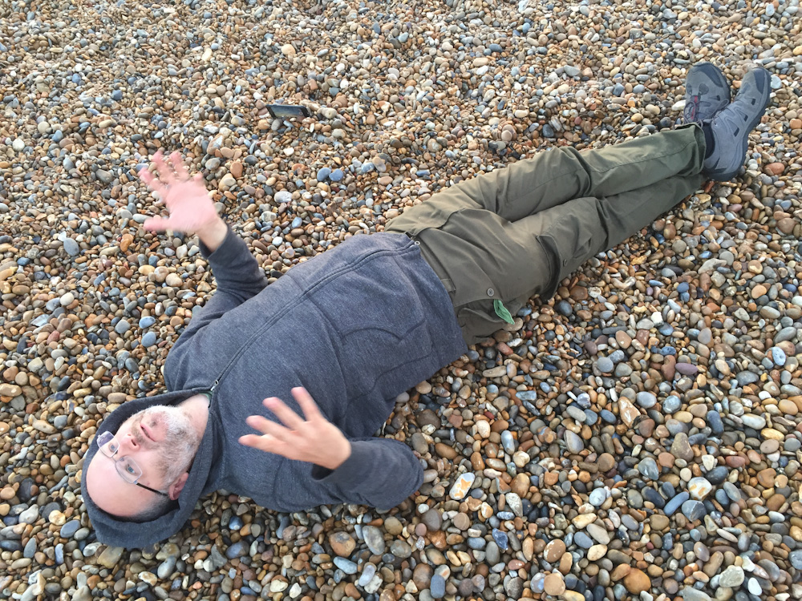

# This is Pete Ashton's website

[I'm an artist](http://art.peteashton.com), working with cameras and data, based in Birmingham in the North West of Europe.

## Contact

Email: pete@peteashton.com  
Tel: +44 (0)7776 690 106  
Twitter: [@peteashton](http://twitter.com/peteashton)

## Blog

Sometimes my head gets too full and I need to pour words into [blog.peteashton.com](http://blog.peteashton.com).

## Newsletter

I send a "what Pete's up to" email out every couple of months. [Subscribe here.](http://eepurl.com/bSB4Kn)

## Projects

I'm involved in various things, often with other people. 

-	[Photo School](http://photo-school.co.uk) - Teaching photography and running photo walks in Birmingham. 
 
-	[Birmingham Camera Obscura](http://bhamobscura.com) - Exploring and building camera obscuras with Jenny Duffin.  

-	[Cross City Walks](http://xcw.org.uk) - A walking project bisecting cities in straight lines with Andy Howlett.

-	[Bunminster Fuller & co](http://bunminster.uk) - Rabbits are awesome.  

## Presences

I have content on the following commercial online services:

-	[Twitter](https://twitter.com/peteashton)  
-	[Tumblr](http://peteashton.tumblr.com)  
-	[Vimeo](http://vimeo.com/peteashton/)
-	[Pinboard](https://pinboard.in/u:peteashton/)  
-	[GitHub](https://github.com/peteash10) 
-	[Instapaper](https://www.instapaper.com/p/peteashton) 
-	[Instagram](https://www.instagram.com/peteashton/)  
-	[Flickr](https://www.flickr.com/photos/peteashton/)

