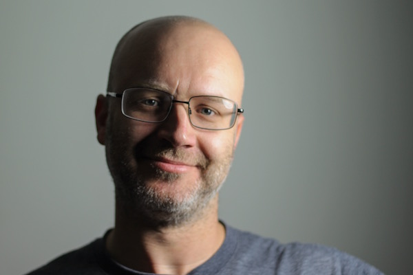

# This is Pete Ashton's website

I'm an artist, mostly working with cameras, based in Birmingham in the North West of Europe.

## Contact

Email: pete@peteashton.com  
Tel: +44 (0)7776 690 106  
Twitter: [@peteashton](http://twitter.com/peteashton)

## Photo

## Newsletter

I send a "what Pete's up to" email out every few weeks. [Subscribe here.](http://eepurl.com/bSB4Kn)

## Art

I am a practicing artist at the start of my career.  

-	[BOM Fellowship](http://bom.org.uk) - I'm a Birmingham Open Media Fellow.  

-	[My portfolio is on this page](/art/).

-	My work through 2017 concerns cameras, images and artifician intelligence and [is being documented and developed here](https://github.com/peteash10/2017-body-of-work).

-	I'm part of the [Goodbye Wittgenstein](http://a3projectspace.org/index.php/project/goodbye_wittgenstein/) residency exchange with A3 Projects Space in Birmingham and qujOchÖ in Linz, Austria.

## Projects

I'm involved in various things, often with other people. 

-	[Photo School](http://photo-school.co.uk) - Teaching photography and running photo walks in Birmingham. 
 
-	[Birmingham Camera Obscura](http://bhamobscura.com) - Exploring and building camera obscuras with Jenny Duffin.  

-	[Cross City Walks](http://xcw.org.uk) - A walking project bisecting cities in straight lines with Andy Howlett.

-	[Bunminster Fuller & co](http://bunminster.uk) - Rabbits are awesome.  

## Presences

I have content on the following commercial services:

-	[Twitter](https://twitter.com/peteashton)  
-	[Tumblr](http://peteashton.tumblr.com)  
-	[Vimeo](http://vimeo.com/peteashton/)  
-	[GitHub](https://github.com/peteash10)  
-	[Instagram](https://www.instagram.com/peteashton/)  
-	[Flickr](https://www.flickr.com/photos/peteashton/)

