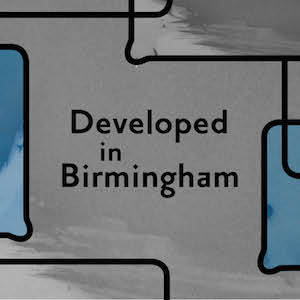

Here's a list of upcoming things I'm either running, am involved with or want you to know I'm attending.

## May

Thu 25th: Performing a new work, Echo Edit, at [Live Art Cinema](http://hfwas.co.uk/?p=3694), The Edge, Birmingham.

## June

Fri 2nd: Listen To The Walls, a new sonogramatic installation premiering at the Transmission group show at [Vivid Projects](http://www.vividprojects.org.uk/programme/).

Sun 4th: [Digbeth photo walk](https://ti.to/photo-school/digbeth-june-2017).

Thu 8th: [Show and Tell](http://art.peteashton.com/showandtell/) artists meeteup at Artefact cafe.

Sun 11th: [Beginners Photography class](https://ti.to/photo-school/beginners-photography-loaf-june-11), Stirchley

## July

Sun 2nd: [Spaghetti Junction photo walk](https://ti.to/photo-school/spaghetti-junction-summer-2017).

Thu 13th: [Show and Tell](http://art.peteashton.com/showandtell/) artists meeteup at Artefact cafe.

## August

[Developed in Birmingham](https://www.developedinbirmingham.com) - a season of events celebrating early photography for which I'm running:

- 7th - 12th: [Portrait Studio Hack Week](https://www.developedinbirmingham.com/programme/portrait-studio-hack-week/) - a camera obscura studio ([ala Hockney](http://bhamobscura.com/2014/08/david-hockneys-secret-knowledge/)) installed at [BMAG](http://www.birminghammuseums.org.uk/bmag).
- Sat 12th: [Portrait Studio Workshop](https://www.developedinbirmingham.com/programme/portrait-studio-drop-in-workshop/) - 12-5pm. Free drop-in.
- Sat 19th: [Speculative Camera Workshop](https://www.developedinbirmingham.com/programme/speculative-cameras-workshop/) at [BMAG](http://www.birminghammuseums.org.uk/bmag). 12-4pm. £5.
- Tue 29th: [Birmingham Camera Obscura](https://www.developedinbirmingham.com/programme/bham-camera-obscura-appearance/) appearance at Millennium Point. 11am-3pm.

Thu 10th: [Show and Tell](http://art.peteashton.com/showandtell/) artists meeteup at Artefact cafe.

## September

tbc: [Beginners Photography](http://photo-school.co.uk/beginners-photography/) classes start again.

7th - 11th: Peforming with [qujOchÖ](http://qujochoe.org) at [Ars Electronica Festival](https://www.aec.at/ai/en/), Linz, Austria.

tbc: Talk for [Black Hole Club](http://www.vividprojects.org.uk/programme/black-hole-club-2017/) about Ars Electronica visit.  

## October

4th: [Instructons for Humans](http://art.peteashton.com/instructions-for-humans/) exhibition  at BOM from early October to late January

## November

tbc: [Instructons for Humans](http://art.peteashton.com/instructions-for-humans/) performances, walks and symposium.