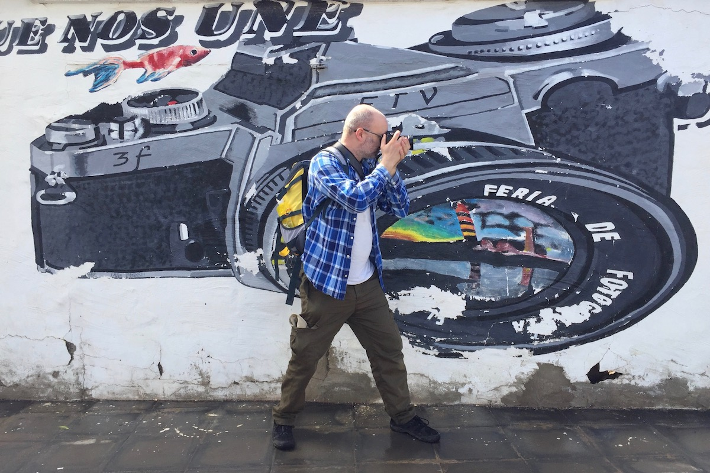

I am not a professional photographer, by which I mean I do not make a living from taking photos and selling them. I make a living in other ways. That said, photography is at the heart of most of my work so it can get a little confusing.  

I've been taking photos quite a while now and most of them are on the internet in some form. This means people sometimes use them for purposes of their own, and I'm generally fine with that. 

I accept that copyright is broken, in that it only serves those with the most lawyers. If you really want to use one of my images against my wishes it's very doubtful I have the time, resources or inclination to fight you. You will, however, probably end up in a circle of the hell of your belief system, so there's that. 

**This page attempts to outline my wishes**, such as they are. If you don't think you come under the following and still want to do the right thing, please get in touch.

**In most individual cases I don't care.** If you want to print one of my photos for your house or use one of my pictures in your presentation or on your blog, go for it. High resolution versions are usually available to download from Flickr.

**If you're some kind of artist** and I've photographed you or your activities, such as a performance or work, and you would like to use my photo to document or promote that activity, please take the photo as if it were your own. I'd be honoured and would love to see how you've used it. No credit is required.

**If you want to use my photo in a commercial environment**, especially where it will appear in public, then I'd really like you to pay me a commercial rate. This is only fair to those who are attempting to make a living from such things. I don't want to undercut them. 

**In the unlikely event of a photo of mine becoming newsworthy**, all far-right news outlets (Daily Mail, Sun/Times, Express), or tainted by association with such an entity, can fuck off. Those supported by advertising can pay a journalist rate which I may keep or may donate to a rabbit charity, depending. Media independent of such surveillance shenanigans can help themselves. 

**I don't require a credit for my photographs accompanying someone else's work**, such as an article or  in a brochure. No-one cares who took the photo in these situations. That said, if you have space it's a nice gesture. If it's online, please link to peteashton.com.

Despite it being a graveyard I still put my DSLR pics on [Flickr](https://www.flickr.com/photos/peteashton/) where they're assigned the [Attribution-NonCommercial](https://creativecommons.org/licenses/by-nc/2.0/) Creative Commons license. This means you can use any of them for non-commercial purposes without asking my permission as long as you give attribution. Go crazy. 

In summary, if you or someone else are making serious money from the use of my photography then you should pay me. If you're using my photography as part of a non-commercial activity or artwork then have at it. If in doubt, drop an email to [pete@peteashton.com](mailto:pete@peteashton.com).