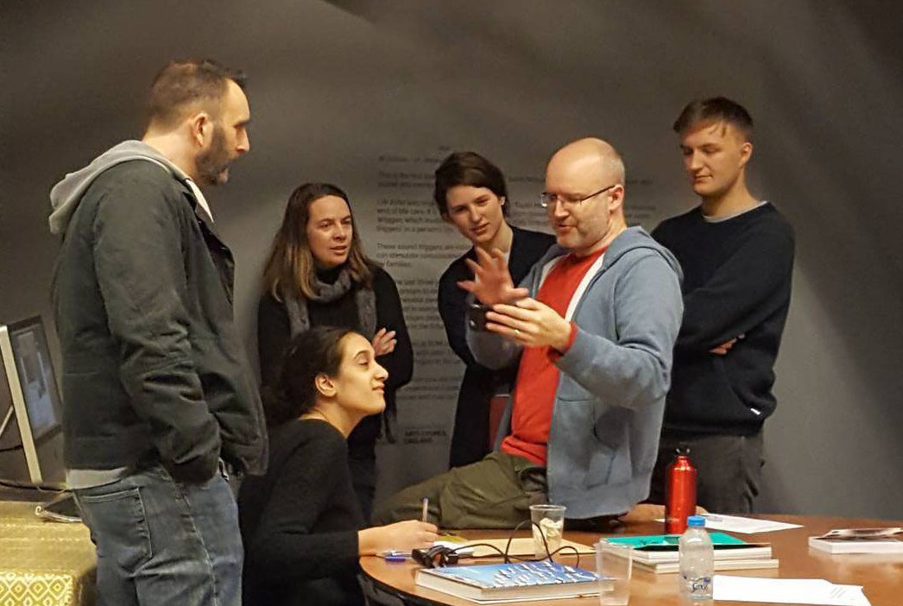
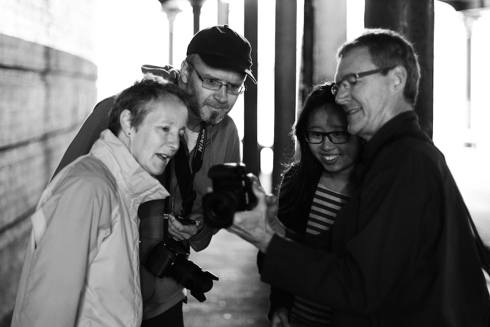
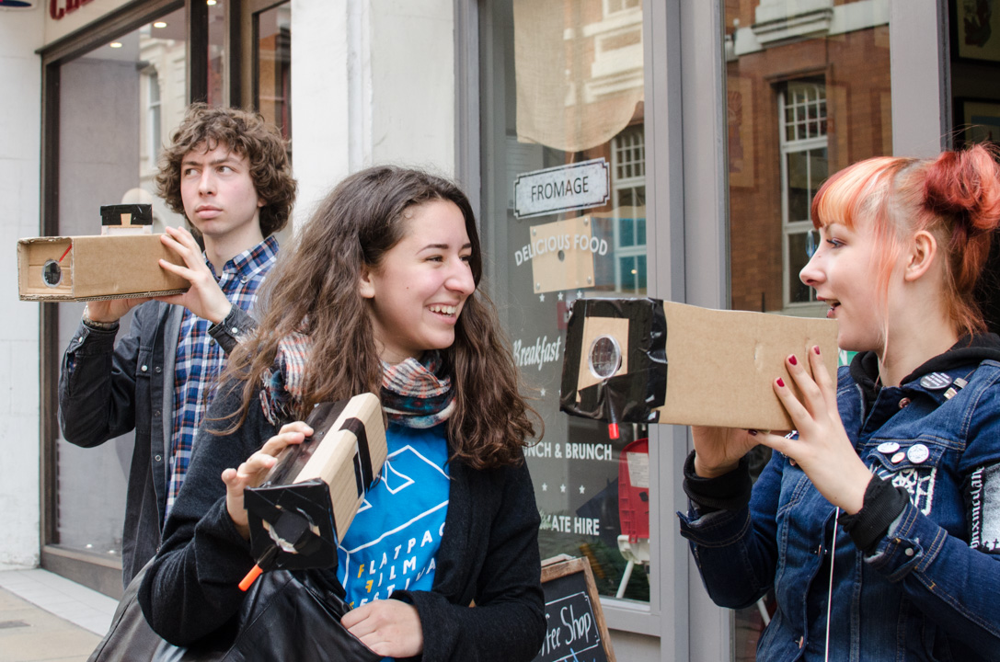
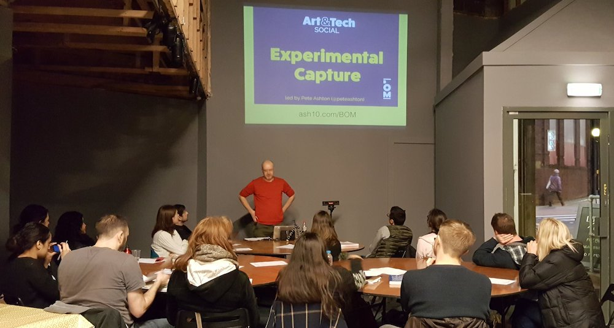

I'm an experienced workshop facilitator in a number of areas related to photography, art and technology. This is a small selection of the workshops I've delivered recently.

If you are interested in employing me to run any of the following, or to develop something new along these lines, please get in touch. 

T: 07775 690 106   
E: [pete@peteashton.com](mailto:pete@peteashton.com)

# Photography

My practical photography workshops usually come under the banner of [Photo School](http://photo-school.co.uk) which I have been running since 2012. 

**Beginners Photography** is a regular five hour workshop for adults aimed at understanding the fundamentals of photography with an entry-level DSLR camera. Covering exposure and composition it lays the foundation for future self-directed study. Alongside the regular classes I frequently adapt and tailor this for specific audiences and needs. [More info.](http://photo-school.co.uk/beginners-photography/)

**Photography Masterclass** is a tailored workshop aimed at organisations that want to develop how audiences creatively engage with their programming, using exhibitions and collections as an inspirational framework and results in a deeper awareness of the work along with development of technical and aesthetic skills. Developed with the [Ikon](https://ikon-gallery.org) gallery. [More info.](http://photo-school.co.uk/photography-workshops/photography-masterclasses/)

**Active Seeing** workshops concentrate on the moment before the photograph is taken, encouraging awareness of the environment around us and aiding contemplation. Designed to complement therapeutic courses, participants also develop compositional skills and create rewarding images. [More Info.](http://photo-school.co.uk/photography-workshops/active-seeing-workshops/)

# Technology

My technology workshops usually evolve from my [artistic practice](http://art.peteashton.com) of exploring the strange edges of image-making. 

**Speculative Cameras** is a workshop based on research for my art practice and draws heavily on [Golan Levin's Experimental Capture](https://github.com/golanlevin/ExperimentalCapture) course which I attended in 2016 and [work by James George and Alexander Porter](http://scatter.nyc/camera-of-the-future-workshop). It invites participants to look beyond the functionality of the DLSR or Smartphone and explore new models and approaches for capturing and processing images. A smorgasbord of subjects are available which can be selected to suit your audience. Run in 2017 for [Birmingham Open Media](http://www.bom.org.uk/event/artandtech-pete-ashton/) and the [Developed in Birmingham](https://www.developedinbirmingham.com/programme/speculative-cameras-workshop/) festival. 

**Camera Obscura Workshop**, developed with [Jenny Duffin](http://jennyduffin.com) as part of the [Birmingham Camera Obscura](http://bhamobscura.com) project, this sees participants building functional cameras from cardboard boxes, magnifying glasses and tracing paper. Participants learn about basic optics, focussing light, and start understanding the cameras in their phones. [More info.](http://bhamobscura.com/2015/03/flatpack-workshop-photos/)

